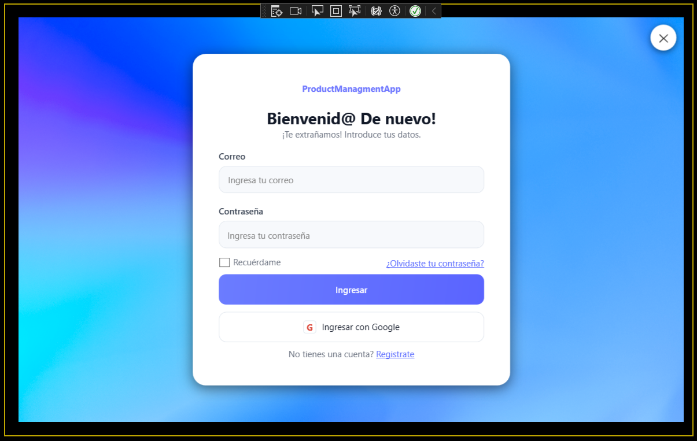
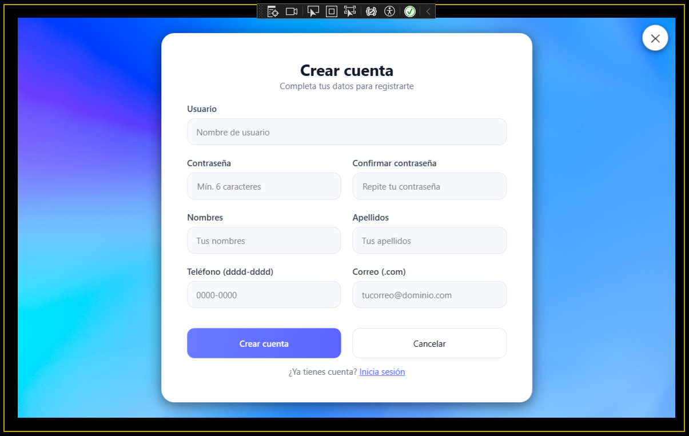
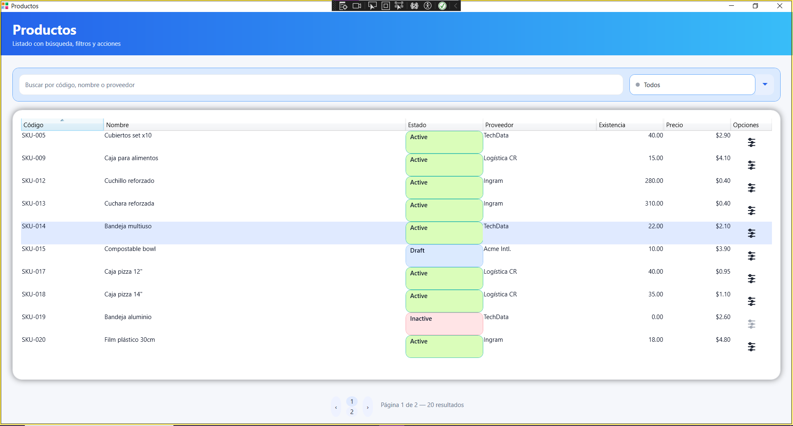
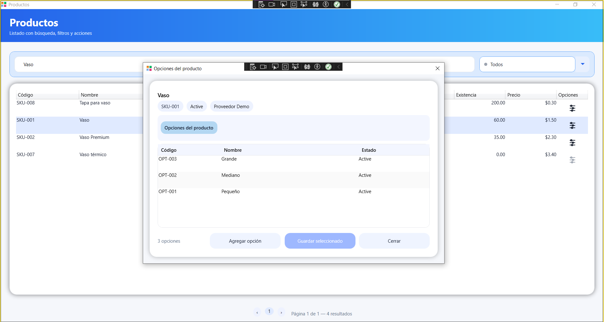
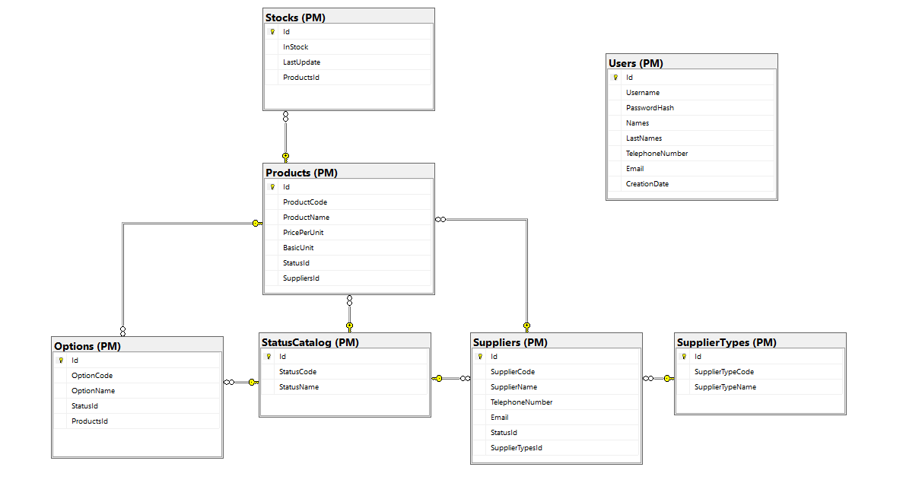

# ProductManagementApp

Aplicación de escritorio **WPF (.NET Framework)** para **gestión de productos** con **SQL Server**.  
Incluye autenticación, registro de usuarios, listado de productos con filtros y gestión de opciones por producto.

> **Ramas:** `master` y **`test`** (todos los commits solicitados por la prueba se realizan en `test`).

---

## ✨ Funcionalidad

- **Login**: acceso solo si usuario/correo + contraseña existen en BD.
- **Registro**: alta de usuarios guardando todos los campos de `PM.Users`.  
  *(Req.3: valida email `.com` y teléfono `dddd-dddd`.)*
- **Productos**: listado con **búsqueda por texto** y **filtro por estado**.
- **Opciones por producto**: visualización, **alta** y **edición**.
- **UI**: diseño moderno (card con sombra/blur, placeholders), ventana sin marco.

---

## ✅ Trazabilidad de requisitos

| Requisito | Implementación |
|---|---|
| **Req.1 – BD** (Productos, Usuarios, Opciones) | `Scripts/Database.sql` |
| **Req.2 – Login + Registro** | `Views/LoginWindow.*`, `Views/RegisterWindow.*`, `Repositories/UsersRepository.cs` |
| **Req.3 – Validaciones registro** | `Views/RegisterWindow.xaml.cs` |
| **Req.4 – Listado con filtros** | `Views/MainWindow.*`, `Repositories/ProductsRepository.cs` |
| **Req.5 – Ver opciones por producto** | `Views/ProductOptionsWindow.*`, `Repositories/OptionsRepository.cs` |
| **Req.6 – CRUD de opciones** | `Repositories/OptionsRepository.cs`, `Views/ProductOptionsWindow.*` |
| **Req.7 – GitHub** (commits por requisito en `test`) | Rama **`test`**, README, estructura |

> Mensajería de commits sugerida:  
> `db(sql): ... (Req.1)` / `feat(auth): ... (Req.2)` / `feat(register-validate): ... (Req.3)` / `feat(products): ... (Req.4)` / `feat(options*): ... (Req.5/6)` / `docs(repo): ... (Req.7)`.

---

## 🧱 Arquitectura

ProductManagementApp/
├─ App.config
├─ Scripts/ # SQL: creación + seed
├─ Data/ # SqlDb (connection factory)
├─ Models/ # Entidades 1:1 con BD
├─ DTO/ # Modelos para UI (p.ej., UserRegistration)
├─ Repositories/ # ADO.NET: Users/Products/Options
├─ Services/ # Servicios de dominio (Auth, etc.)
├─ Security/ # PasswordHasher
├─ ViewModels/ # (MVVM-ready)
├─ Views/ # WPF XAML (Login, Register, Main, ProductOptions)
└─ Resources/Docs/ # Imágenes para README (capturas/diagrama)


**Decisiones**
- ADO.NET con SQL **parametrizado**.
- Hash de contraseñas centralizado (ver sección Seguridad).
- `SYSUTCDATETIME()` para fechas de creación (consistencia desde la BD).
- Listo para evolucionar a **MVVM** puro (ViewModels + Commands).

---

## 🗄️ Base de datos

- Script completo en `Scripts/Database.sql` (esquema `PM` y tablas: `StatusCatalog`, `SupplierType`, `Supplier`, `Products`, `Stock`, `Options`, `Users`).
- Incluye claves foráneas y catálogos.

**Conexión (App.config)**

```xml
<connectionStrings>
  <add name="PM"
       connectionString="Data Source=.\SQLEXPRESS;Initial Catalog=ProductManagement;Integrated Security=True;TrustServerCertificate=True"
       providerName="System.Data.SqlClient" />
</connectionStrings>

## 🖼️ Capturas

- **Login**  
  

- **Registro**  
  

- **Productos (listado + filtros)**  
  

- **Opciones por producto**  
  

- **Modelo de Base de Datos**  
  


## 🔀 Flujo de ramas / Git

Ramas:
- **master** → principal (limpia).
- **test** → trabajo (todos los commits de requisitos).

### Configuración inicial
```bash
# en la carpeta del proyecto
git init
git remote add origin https://github.com/AlisonRoa/ProductManagementApp.git

# rama principal y de trabajo
git checkout -b master
git checkout -b test
